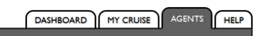

# 水平排列元素（高度不同）的底部对齐方式



1. absolute + bottom
``` css
.parent {
    position: relative;
}
.child {
    position: absolute;
    bottom: 0;
    width: 50px;
}
```
2. vertical-align + inline-block
```css
.child {
    display: inline-block;
    vertical-align: bottom;
}
```

3. flex + align-items
```css
.parent {
    display: flex;
    align-items: flex-end;
}
```


## 总结
- 最佳方案 flex
- 需要保证兼容的话,方案2 最好
- 万不得已 方案1
